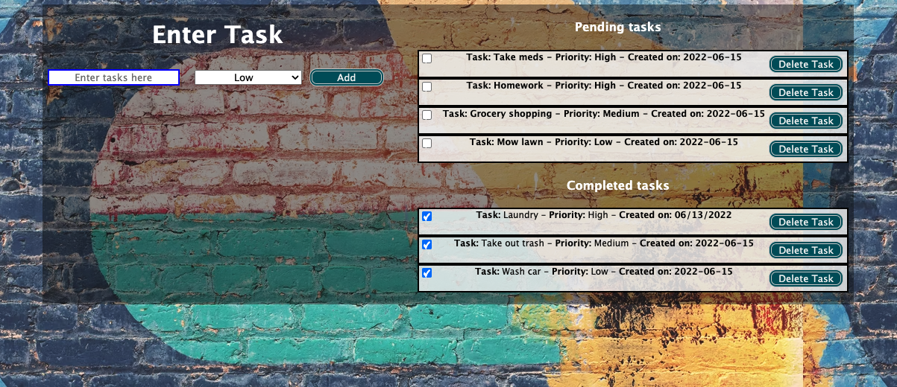
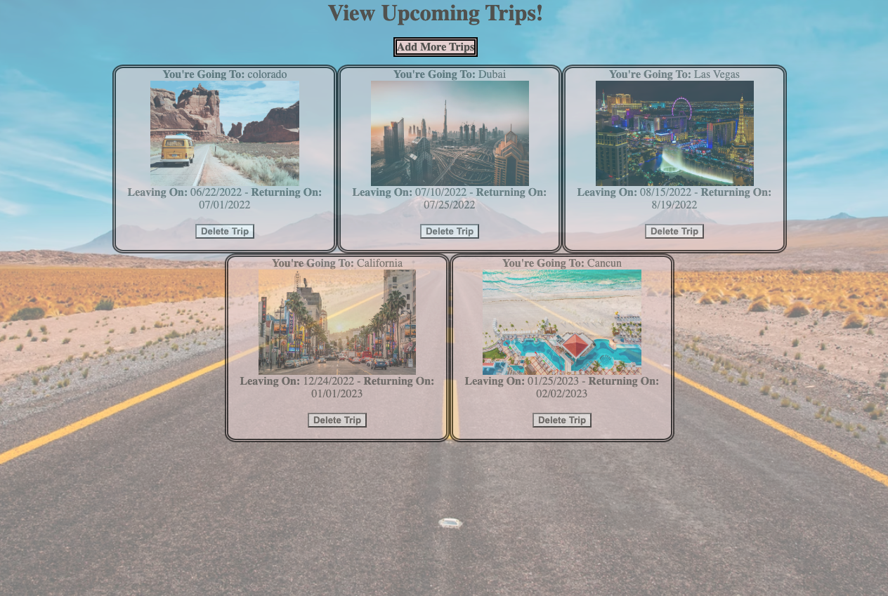

# Back-End

## Project 1 - To Do List App

Site Preview:

  

Instructions:

In this project you are responsible for creating the Web API for TODO app using Node.

Your API will expose the following endpoints:

Get all TODO items (/todos)
Save a new TODO item (/todos)
Each TODO item consists of the title, priority, dateCreated

You are also responsible for creating the User Interface for your app which will consume the API.

## Project 2 - Travel Planner App

Site Preview:

  

Instructions:

You are in charge of creating a website for tracking trips. You will use server side pages using Mustache or any other server side template framework for this assignment.

Your app should allow users to do the following:

Ability to add a new trip. A new trip consists of title, image (allow user to enter url instead of uploading an image), date of departure, date of return

Ability to view all the trips

Ability to delete a trip (Do this last, since deleting a trip is difficult. Hint - You can have multiple forms)

Your app should work on mobile devices
