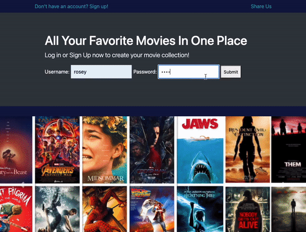
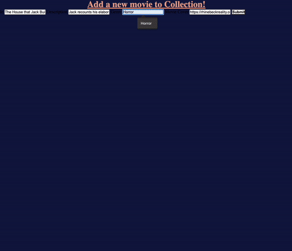

# Back-End

## Movie Server with Chat Feaature Final Product

Summary: Add socket.io to movie server to enable a chatroom feature.

Site Preview:

  

Instructions:

You will use server side pages using Mustache or any other server side template framework for this assignment.
Your app should allow users to do the following:
Ability to add a new movie. A new trip consists of title, image, genre, poster
Ability to view all the movies
Ability to delete a movie
Add the ability to allow user to register for the website
Allow the user to login to the website
Allow the user to signout from the website
Allow the user to only see their movies after they login successfully

- Allow the users to join a chat room where they can chat with other users.
- Display username along with the chat messages
  Your app should work on mobile devices

## Project 1 - To Do List App

Summary:

Create an API with node express to store the user's tasks

Site Preview:

  

Instructions:

In this project you are responsible for creating the Web API for TODO app using Node.
Your API will expose the following endpoints:
Get all TODO items (/todos)
Save a new TODO item (/todos)
Each TODO item consists of the title, priority, dateCreated
You are also responsible for creating the User Interface for your app which will consume the API.

## Project 2 - Travel Planner App

Summary:

Create a backend server using mustache express, gives user ability to create and view travel plans

Site Preview:

  

Instructions:

You are in charge of creating a website for tracking trips. You will use server side pages using Mustache or any other server side template framework for this assignment.
Your app should allow users to do the following:
Ability to add a new trip. A new trip consists of title, image (allow user to enter url instead of uploading an image), date of departure, date of return
Ability to view all the trips
Ability to delete a trip (Do this last, since deleting a trip is difficult. Hint - You can have multiple forms)
Your app should work on mobile devices

## Project 3 - Movies Website

Summary:

Use mustache express and create routers to allow user to make and view their movie collection

Site Preview:

  

Instructions:

In this assigment you are going to allow a user to keep track of their movie collection. Create a website which will allow the user perform the following features:
Ability to add a movie (title, description, genre, posterURL)
Ability to view all movies
Ability to delete a movie
Ability to filter movies based on the genre
Ability to go to movie details page

Routes:
/movies - View all movies (Show the poster image and the name of the movie on this age)
/movies/create - POST - Add a new movie
/movies delete - POST - Deletes a movie
/movies/:movieId - Details about the movie (Show poster image, title, genre and description on this page)
/movies/genre/:genre - Show movies based on genre
Use Express Router to create movies.js route which will contain all the routes of the movies
